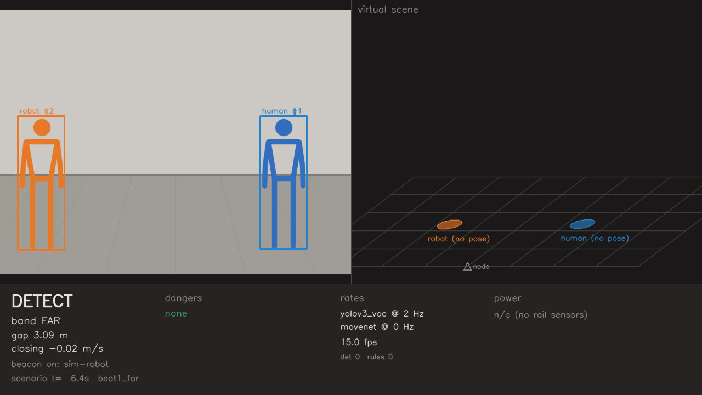
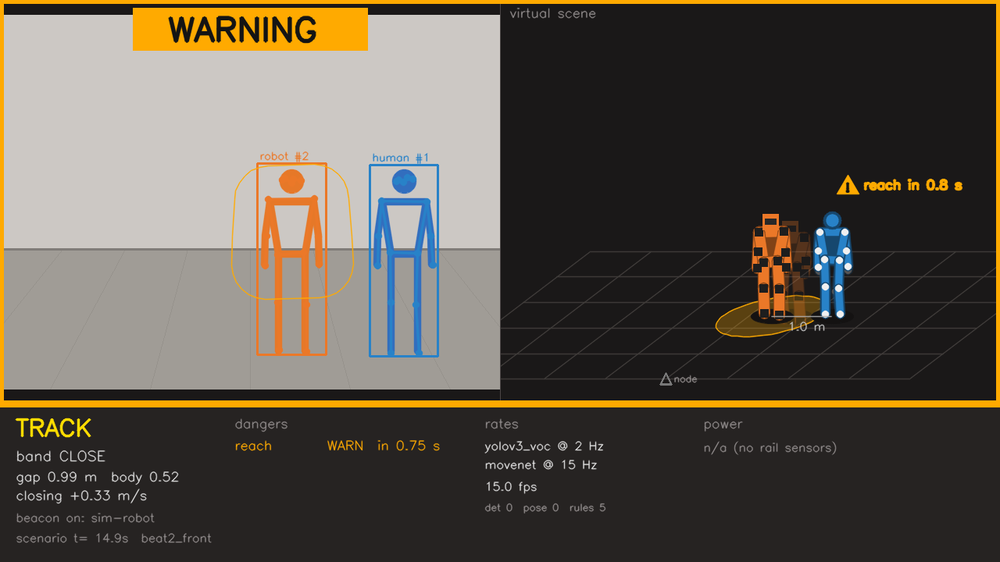
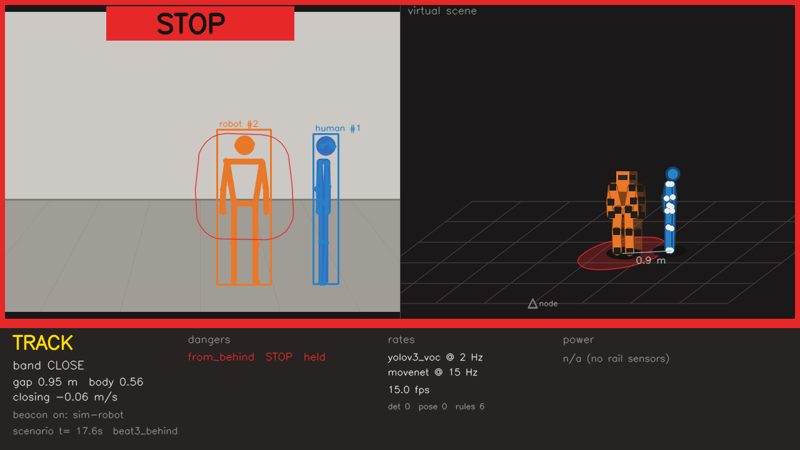
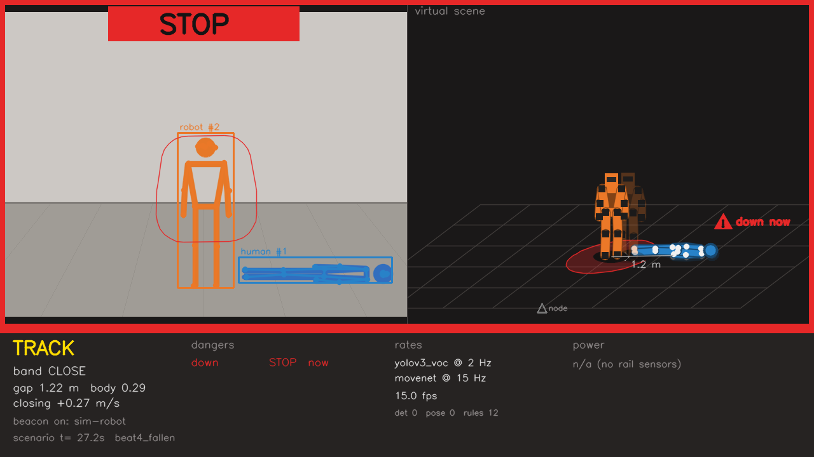

# CPSA_2026

CPSA_2026 is a modular Python cyber-physical system for real-time multisensory feedback. It combines wearable BLE sensing, C-accelerated IMU processing, embedded stereotypy classification, DPU-accelerated computer vision, an event dispatcher, and multimodal actuators.

The current runtime is centered on dual BlueCoin IMU acquisition and a staged video pipeline. IMU classification drives the event system. The dispatcher then coordinates feedback actuators and, depending on the current classification tag, activates YOLO or MoveNet DPU inference. A single dashboard owns the OpenCV GUI and displays the current video state.

## Guardian Node

Guardian Node is an infrastructure-side safety supervisor for a mobile robot, running on the AMD Kria KV260. A fixed camera watches the robot and nearby people, independent of the robot. A YOLO person detector gates MoveNet poses, and a deterministic rule engine decides NONE / WARN / STOP. Decisions are shown on an HDMI dashboard (camera overlay, virtual floor scene, status strip) and played as audio. The robot's beacon is simulated for now (`guardian/io.py`), and the robot link only logs its commands.

The code lives in `guardian/`, with the entry point in `guardian_main.py`. The upstream IMU pipeline (`main.py`, `core/`, `actuators/`) is not used by it.

### Rules

| Rule | STOP when | WARN when |
|------|-----------|-----------|
| `reach` | a human joint is inside the robot's arm hull, dilated by `reach_margin_m` | STOP is predicted within the look-ahead |
| `from_behind` | the robot is closing within `behind_m` of a human who faces away from it | predicted |
| `down` | the human is lying or crouched, with a joint within `reach_m` of the robot's body | within `down_warn_m`, or predicted |
| `pinned` | the human is between a closing robot and a configured static line | predicted |
| `overhead` | the robot's wrists are above its shoulders, with a human within `drop_radius_m` | predicted |

The predictor extrapolates joint velocities over `predictor.horizon_s`. A STOP it predicts becomes a WARN with a time to contact. STOP stays latched for `decision.stop_hold_s`.

### Model cascades

A band's detector, and `pose.models`, can be a list of models ordered cheapest first (`guardian/cascade.py`). A cheap result is accepted only when it is confident and agrees with the tracker. "Nobody there" is never taken on trust: a confirmed track without a matching detection escalates to the next model.

The next model also runs directly, skipping the cheap one, in four cases:
- The watchdog is due: the full detector runs at least every `cascade.watchdog_s` (3 s). This catches people the cheap model never detected. It is safe while the robot closes at ≤ ≈0.6 m/s from the 3 m band.
- A rule is within `cascade.sensitivity_m` of flipping its decision, or a STOP is predicted.
- A torso accelerates faster than `cascade.sudden_accel_mps2` (2 m/s²): lunges, falls, abrupt starts and stops. The acceleration comes from a quadratic least-squares fit over the pose history (the last 0.5 s, stretched back to 5 poses at low pose rates). In the demo it fires during the fall and when the scripted robot reverses; walking and pose noise stay below 1.7 m/s².
- The person is lying down.
- `from_behind` could fire and the cheap pose model has no face points.

`--cascade` runs the survey's recommendation: RefineDet-ped 0.96 before OFA-YOLO, and SPnet before MoveNet. On the laptop, stand-ins play these models. The cheap stand-ins miss lying people and have no face points. Used alone, they give a false STOP in beat 2 and lose the fallen person in beat 4 (see `tests/test_scenario.py`). With the cascade, the demo matches the full models. Estimated DPU time saved in the demo is ≈20 % for detection and ≈27 % for pose. The demo is almost all hazard, so this is a lower bound. None of these models has a DPU backend yet.

### Laptop demo (no FPGA)

```sh
uv sync
uv run python guardian_main.py                  # real time, MJPEG stream on http://localhost:8080/
uv run python guardian_main.py --fast --no-audio --port 0 --record out/demo.mp4 --snapshots out/snaps
uv run python guardian_main.py --fast --cascade --no-audio --port 0 --record out/demo_cascade.mp4
uv run pytest -q                                # unit tests + the scenario (full models, cascade, cheap-only control)
```

The synthetic scenario replays ground truth in place of the DPU models. It plays four beats:

| Beat | Time | Expected |
|------|------|----------|
| 1: robot passes far away | 3–9 s | DETECT, no danger |
| 2: robot approaches from the front | 9–16 s | WARN `reach` (predicted) |
| 3: human turns away, robot keeps closing | 16–19.5 s | STOP `from_behind` |
| 4: robot approaches a fallen human | 23–30 s | WARN, then STOP `down` |

| Beat 1 | Beat 2 |
|---|---|
|  |  |
| **Beat 3** | **Beat 4** |
|  |  |

### Board (KV260)

```sh
./run.sh                          # sudo, PYNQ env, then: guardian_main.py --source webcam --backend dpu --hdmi
./run.sh --power                  # also read the power rails into the dashboard
sudo -i; source /etc/profile.d/pynq_venv.sh; python3 tools/power_experiment.py --out out/power
```

- Shut down Jupyter kernels first. Only one process may own the DPU and the webcam.
- Only Vitis AI 2.5 xmodels load on the PYNQ-DPU 2.5 overlay.
- `tools/power_experiment.py` follows `docs/model_survey.md` section 4.4. It writes `out/power_samples.csv` and `out/power_summary.csv`.

### Configuration

**Live tuning.** Open `http://<node>:8080/` to see the dashboard stream next to every tunable setting: thresholds, rates, hysteresis, cascade values, rule switches, and the model per band (chosen among the models loaded at startup). Each setting shows its range and default, and hovering over its name explains what changing it does.
- A change is applied at the next frame. Tracks and history are kept.
- Every change is written to the event log with its old and new value.
- Changes are saved to `guardian_tuning.json` (git-ignored; `--tuning PATH` to move it, `--tuning ''` to turn it off) and loaded again at the next start.
- A command-line flag such as `--cascade` or `--no-audio` still wins for its run. "Reset" goes back to the startup value.
- Camera, display, model files and `static_lines` are startup-only.
- **There is no authentication.** Anyone who can reach the port can change thresholds or switch rules off, so only use it on a trusted lab network.

Defaults are in `guardian/config.py`. Override any of them in a `guardian:` section of `config.yaml`:

```yaml
guardian:
  bands:                      # robot-human distance bands set detector and pose rates
    far_m: 3.0
    close_m: 1.5
    rates:
      close: {detector: yolov3_voc, detector_hz: 2.0, pose_hz: 15.0}
  rules:
    reach_m: 0.8
    down_warn_m: 1.5
    behind_m: 1.5
    static_lines: [[0.9, 0.0, 0.9, 1.0]]   # walls for `pinned`, normalised image coordinates
    enabled: [reach, from_behind, down, pinned, overhead]
  decision: {stop_hold_s: 2.0, warn_hold_s: 1.0}
  roles: {robot_is: leftmost}              # until the beacon reports the robot's position
  audio: {device: "hw:0,3"}                # aplay -D device for HDMI audio (check with aplay -l)
  display: {dp_pixel_format: rgb}          # rgb | bgr, if the HDMI colours look swapped
  power: {rails: []}                       # pynq.get_rails() names to sum; empty = all
```

The `hw:0,3` audio device and the `rgb` pixel format have not been verified on the board yet.

---

## Table of Contents

- [Guardian Node](#guardian-node)
- [System View](#system-view)
- [Architecture and Working Principle](#architecture-and-working-principle)
  - [Architecture](#architecture)
  - [Runtime Flow](#runtime-flow)
  - [Project Structure](#project-structure)
- [Installation, Configuration, and Troubleshooting](#installation-configuration-and-troubleshooting)
  - [Target Environment](#target-environment)
  - [System Dependencies](#system-dependencies)
  - [Python Dependencies](#python-dependencies)
  - [DPU / Vitis-AI Runtime Setup](#dpu--vitis-ai-runtime-setup)
  - [Configuration](#configuration)
  - [Run Procedure](#run-procedure)
  - [Operational Shutdown](#operational-shutdown)
  - [Troubleshooting](#troubleshooting)
- [Runtime Components](#runtime-components)
  - [IMU Pipeline](#imu-pipeline)
  - [Video Pipeline](#video-pipeline)
  - [Event System and Dispatcher](#event-system-and-dispatcher)
  - [Actuation Policy and Actuator Layer](#actuation-policy-and-actuator-layer)
  - [Dashboard](#dashboard)
  - [Logging](#logging)
- [Extensions](#extensions)
  - [BlueCoin Feature Listeners and Custom Features](#bluecoin-feature-listeners-and-custom-features)
  - [Add a New Sensor](#add-a-new-sensor)
  - [Add a New Actuator](#add-a-new-actuator)
  - [Add a New Video Stage](#add-a-new-video-stage)
- [Notes on Current Behavior](#notes-on-current-behavior)


## System View

- Dual-wrist BLE BlueCoin acquisition
- Accelerometer, gyroscope, and quaternion/sensor-fusion feature listeners
- Left/right IMU synchronization with timestamp skew control
- Sliding-window buffering with configurable overlap
- C shared-library processing for quaternion-based dual-wrist features
- Embedded stereotypy classifier through a shared-library wrapper
- Bounded event queue with drop-oldest behavior for low-latency operation
- Event dispatcher with tag-change handling and actuation cooldown
- Staged DPU video pipeline:
  - YOLOv3 person detection
  - MoveNet pose/keypoint inference
  - normalized wrist-to-face proximity estimation
- Dashboard-owned GUI for video rendering and runtime termination
- Modular actuator manager for:
  - BLE MetaMotion haptic feedback
  - Bluetooth speaker feedback
  - Wi-Fi LED strip feedback
- Adaptive actuation policy with retry, variation, severity, and actuator-rotation logic
- Centralized shutdown of dispatcher, video threads, sensors, actuators, and dashboard resources

---

## Architecture and Working Principle

The system is organized around an IMU-first event loop. Dual BlueCoin devices provide synchronized wrist motion data. The classifier produces stereotypy tags. The dispatcher consumes the latest tag, switches video stages as needed, and asks the actuation policy to select feedback behavior. The dashboard owns video rendering and termination input.

### Architecture

```text
Dual BlueCoin BLE Sensors
        │
        ▼
SensorManager
        │
        ▼
Feature Listeners
        │
        ▼
IMUSynchronizer
        │
        ▼
DataBuffer
        │
        ▼
C Processing Shared Library
        │
        ▼
StereotipyClassifier
        │
        ▼
Shared Event Queue
        │
        ▼
EventDispatcher
        ├──────────────► YOLO DPU Thread
        │                       │
        │                       ▼
        ├──────────────► MoveNet DPU Thread
        │
        ▼
StereotipyActivationPolicy
        │
        ▼
ActuatorManager
        │
        ├── BLE MetaMotion
        ├── Bluetooth Speaker
        └── Wi-Fi LED Strip

VideoDashboard renders YOLO / MoveNet frames and receives the q key for GUI shutdown.
```

The dispatcher is the central coordinator. It consumes IMU classifier events, updates the active video stage, applies cooldown logic, calls the actuation policy, and triggers actuators through the manager.

---

### Runtime Flow

`main.py` is the runtime entry point. It performs the following sequence:

```text
1. Create the VideoDashboard.
2. Register the dashboard console.
3. Create SensorManager and ActuatorManager.
4. Scan BLE sensors.
5. Read expected BlueCoin names from config.yaml.
6. Retry BlueCoin discovery up to 5 times if required devices are missing.
7. Scan actuators.
8. Initialize actuators.
9. Initialize sensor threads.
10. Read discovered actuator IDs.
11. Create StereotipyActivationPolicy.
12. Create YoloDpuThread.
13. Create MoveNetDpuThread.
14. Create EventDispatcher with the actuator manager, policy, YOLO thread, and MoveNet thread.
15. Start YOLO, MoveNet, and dispatcher threads.
16. Enter the dashboard render loop.
17. Stop when Ctrl+C is received or q is pressed in the GUI.
18. Cleanly stop dispatcher, video threads, sensors, actuators, and dashboard resources.
```

Important runtime details:

- The DPU overlay must be loaded before `main.py` starts. Use `bash xmutil_load_dpu.sh` at system startup.
- `main.py` is now the direct runtime entry point. `CPSA_RUN.sh` has been removed.
- YOLO and MoveNet threads are started at boot, but they stay idle until the dispatcher activates them.
- The dashboard is responsible for rendering frames and reading GUI key input.
- The system aborts startup if the configured BlueCoin devices are not discovered after the retry loop.
- If no actuators are discovered, event detection and logging still run.

---

### Project Structure

```text
CPSA_2026/
├── actuators/
│   ├── actuator_manager.py
│   ├── BLE/
│   │   └── metamotion.py
│   ├── BT/
│   │   └── speaker.py
│   └── WIFI/
│       └── led_strip.py
│
├── assets/
│   └── audio/
│       └── *.mp3
│
├── core/
│   ├── actuation_policy.py
│   └── event_dispatcher.py
│
├── IMU_pipeline/
│   ├── classifiers/
│   │   └── stereotipy_classifier/
│   │       ├── stereotipy_classifier.py
│   │       ├── predict_models_wrapper_quat.py
│   │       ├── libPredictPericolosaWristsQuat.so
│   │       └── Predict_Pericolosa_Wrists_Quat/
│   └── data_stream/
│       ├── synchronizer.py
│       ├── data_buffer.py
│       ├── data_processing_wrapper_quat.py
│       ├── libProcessDataWristsQuat.so
│       └── ProcessDataWristsQuat/
│
├── sensors/
│   ├── sensor_manager.py
│   └── BLE/
│       ├── bluecoin.py
│       ├── feature_listeners.py
│       └── feature_mems_sensor_fusion_compact.py
│
├── utils/
│   ├── audio_paths.py
│   ├── config.py
│   ├── event_queue.py
│   ├── lock.py
│   ├── logger.py
│   └── video_dashboard.py
│
├── VIDEO_pipeline/
│   ├── YOLO/
│   │   ├── yolo_thread.py
│   │   └── *.xmodel
│   └── MOVENET/
│       ├── movenet_thread.py
│       └── *.xmodel
│
├── DPU_FIRMWARE/
├── config.yaml
├── main.py
├── xmutil_load_dpu.sh
└── README.md
```

---

## Installation, Configuration, and Troubleshooting

This block contains the target environment, dependency installation, DPU setup, configuration, run procedure, shutdown behavior, and common troubleshooting notes. Use it as the operational reference before changing runtime code.

### Target Environment

Tested target environment:

- Ubuntu 22.04
- Python 3.10
- Xilinx Kria KV260 for DPU-accelerated video inference
- USB camera
- BLE adapter compatible with BlueZ and BlueST SDK
- BlueCoin wearable devices
- Optional actuator hardware:
  - MetaMotion BLE device
  - Bluetooth speaker
  - Wi-Fi LED strip

---

### System Dependencies

```bash
sudo apt update
sudo apt upgrade

sudo apt install python3-pip python3-distutils libglib2.0-dev

sudo apt install -y build-essential tk-dev libncurses5-dev libncursesw5-dev \
libreadline6-dev libdb5.3-dev libgdbm-dev libsqlite3-dev libssl-dev \
libbz2-dev libexpat1-dev liblzma-dev zlib1g-dev libffi-dev \
bluetooth bluez libbluetooth-dev libudev-dev libboost-all-dev git

sudo apt install libcap2-bin
```

The DPU video pipeline also requires the Xilinx runtime packages that provide `xir` and `vart`.

---

### Python Dependencies

Install the Python dependencies in the same Python environment used to run `main.py`.

```bash
pip install \
numpy \
pyyaml \
playsound \
flux_led \
opuslib \
bluepy \
blue-st-sdk \
metawear
```

The video pipeline also imports OpenCV, XIR, and VART:

```bash
pip install opencv-python
```

`xir` and `vart` are normally installed through the Xilinx / Vitis-AI runtime, not through standard PyPI.

---

### DPU / Vitis-AI Runtime Setup

The video pipeline requires the Xilinx runtime modules used by the Python code:

```python
import xir
import vart
```

`xir` and `vart` are normally provided by the Xilinx / Vitis-AI runtime, not by standard PyPI. Load the DPU overlay on KV260 before starting the runtime:

```bash
bash xmutil_load_dpu.sh
```

That script should wrap the required `xmutil loadapp ...` command and the DPU firmware path used by the deployed system. Run it once during system startup, before executing `python3 main.py`. The `DPU_FIRMWARE/` directory contains the firmware/application files required by the KV260 DPU overlay.

The model paths are configured in `config.yaml`:

```yaml
yolo_model_name: "/path/to/yolo_model.xmodel"
movenet_model_name: "/path/to/movenet_model.xmodel"
```


### Configuration

The main configuration file is:

```bash
config.yaml
```

Current configuration areas:

```yaml
log_base_path: ~/Desktop/CPSA_logs

enable_system_log: true
enable_actuation_detail: false
debug_system_console: true
debug_event_console: true

metamotion:
  enable: true
  scan_timeout: 2
  fast_retry_attempts: 5
  retry_interval: 5
  retry_sleep: 60

speaker:
  mac: D4:8C:49:C9:DC:9A
  enable: false
  scan_timeout: 5
  fast_retry_attempts: 5
  retry_interval: 10
  retry_sleep: 60

led_strip:
  enable: false
  duration: 2500
  scan_timeout: 10
  fast_retry_attempts: 5
  retry_interval: 5
  retry_sleep: 60

bluecoins:
  - id: bc_left
    name: "CPSA_L2"
  - id: bc_right
    name: "CPSA_R2"

sync:
  max_skew_ms: 30
  stale_ms: 50

buffer:
  window_size: 150
  overlap: 75
  debug_print_buffer: false
  debug_print_features: false

policy:
  attempts: 3

event_queue_size: 1

yolo_model_name: "/path/to/yolo_model.xmodel"
movenet_model_name: "/path/to/movenet_model.xmodel"
```

Make sure the BlueCoin names match the names exposed by the BLE devices. `main.py` reads these names through the configuration layer and refuses to continue if the expected devices are not found after the retry sequence.

---

### Run Procedure

Load the DPU firmware/overlay first, then run the Python entry point directly:

```bash
bash xmutil_load_dpu.sh
python3 main.py
```

`xmutil_load_dpu.sh` must be executed at system startup before `main.py`. It loads the DPU application used by the YOLO and MoveNet VART runners. The project no longer uses `CPSA_RUN.sh`; runtime startup is now done directly through `main.py`.

The system remains active until:

- `Ctrl+C` is received in the terminal, or
- `q` is pressed in the dashboard window.

---

### Operational Shutdown

Shutdown is centralized in the `finally` block of `main.py`.

The stop order is:

```text
1. EventDispatcher
2. YoloDpuThread
3. MoveNetDpuThread
4. SensorManager.stop_all()
5. ActuatorManager.stop_all()
6. unregister_dashboard_console()
7. dashboard.close()
```

This order stops event production and dispatching before releasing hardware resources.

---

### Troubleshooting

Use this section as the first place to check setup and runtime failures. Hardware, BLE, Python SDK, MetaWear, and DPU issues are intentionally grouped here so installation and diagnostics stay together.

#### Common Startup Checks

Before running `main.py`, verify the following:

```bash
python3 --version
python3 -c "import yaml, numpy, cv2"
python3 -c "import xir, vart"
bluetoothctl list
```

Then confirm:

- the DPU overlay has been loaded with `bash xmutil_load_dpu.sh`;
- the expected BlueCoin device names in `config.yaml` match the BLE-advertised names;
- the `.xmodel` paths in `config.yaml` point to existing files;
- optional actuators are enabled only when the corresponding hardware is present and configured;
- the same Python environment is used for dependency installation and for `python3 main.py`.

#### Bluetooth and BlueST SDK

Official BlueST SDK Python repository:

```text
https://github.com/STMicroelectronics/BlueSTSDK_Python
```

##### Verify Bluetooth

```bash
bluetoothctl
list
scan on
scan off
quit
```

If the controller does not appear, inspect kernel messages:

```bash
sudo dmesg
```

Look for missing firmware such as:

```text
rtl_bt/rtl8761bu_fw.bin
rtl_bt/rtl8761a_fw.bin
```

##### Install Missing Firmware Example

```bash
sudo apt install wget
sudo mkdir -p /lib/firmware/rtl_bt

sudo wget -O /lib/firmware/rtl_bt/rtl8761bu_fw.bin \
https://www.lwfinger.com/download/rtl_bt/rtl8761bu_fw.bin

sudo reboot
```

##### BlueST SDK Dependencies

```bash
sudo apt install python3-pip python3-distutils libglib2.0-dev
pip install blue-st-sdk bluepy opuslib
```

##### Grant Bluetooth Permissions to bluepy

```bash
sudo setcap "cap_net_raw+eip cap_net_admin+eip" \
/path/to/venv/lib/python3.x/site-packages/bluepy/bluepy-helper
```

Do not put commas inside the quoted capability string.

##### Python 3.10 BlueST Compatibility Fix

If BlueST SDK fails because of `collections.MutableMapping`, edit:

```bash
.../site-packages/blue_st_sdk/utils/dict_put_single_element.py
```

Change:

```python
class DictPutSingleElement(collection.MutableMapping)
```

To:

```python
class DictPutSingleElement(collection.abc.MutableMapping)
```

##### Add User to Bluetooth Group

```bash
groups
sudo usermod -aG bluetooth <username>
sudo reboot
```

---

#### MetaWear / MetaMotion

This project uses MetaMotion devices as BLE haptic actuators. The Python package is installed through the MbientLab MetaWear SDK, while the runtime registers discovered MetaMotion devices under actuator IDs beginning with `meta_`.

MetaWear SDK Python repository:

```text
https://github.com/mbientlab/MetaWear-SDK-Python/tree/master
```

Install the SDK dependency with:

```bash
pip install metawear
```

##### PyWarble buffer overflow issue

`warble` is installed automatically as a dependency of `metawear`. On the target setup, the release build can cause a buffer overflow. Rebuilding PyWarble in debug mode resolves the issue.

PyWarble repository:

```text
https://github.com/mbientlab/PyWarble
```

To compile PyWarble in debug mode:

1. Uninstall the automatically installed Warble package:

```bash
pip uninstall warble
```

2. Install Git if it is not already available:

```bash
sudo apt install git
```

3. Clone PyWarble with submodules:

```bash
git clone --recurse-submodules https://github.com/mbientlab/PyWarble.git
```

4. Move into the PyWarble directory:

```bash
cd PyWarble
```

5. Edit `setup.py`.

Change the build command line from:

```python
args = ["make", "-C", warble, "-j%d" % (cpu_count())]
```

To:

```python
args = ["make", "-C", warble, "CONFIG=debug", "-j%d" % (cpu_count())]
```

Change the shared-library path from:

```python
so = os.path.join(warble, "dist", "release", "lib", machine)
```

To:

```python
so = os.path.join(warble, "dist", "debug", "lib", machine)
```

6. Install the local debug build:

```bash
pip install .
```

7. Verify the installation:

```bash
pip list | grep warble
```

`warble 1.2.8` should appear in the package list.

##### Runtime configuration

MetaMotion actuation is enabled and configured in `config.yaml`:

```yaml
metamotion:
  enable: true
  scan_timeout: 2
  fast_retry_attempts: 5
  retry_interval: 5
  retry_sleep: 60
```

When enabled, `ActuatorManager` scans for MetaMotion devices, creates `MetaMotionThread` instances, and registers them with IDs using the `meta_` prefix. The actuation policy uses that prefix to generate vibration parameters such as duty cycle and duration.

---

#### DPU / Vitis-AI

If the video pipeline fails on `import xir` or `import vart`, check that the Vitis-AI / DPU runtime is installed and visible to Python.

A common Python path fix is:

```bash
echo 'export PYTHONPATH=/usr/lib/python3.10/site-packages:$PYTHONPATH' >> ~/.bashrc
source ~/.bashrc
```

Load the DPU overlay on KV260 before starting the runtime:

```bash
bash xmutil_load_dpu.sh
```

Confirm the model paths in `config.yaml` point to valid `.xmodel` files.


## Runtime Components

This section describes the internal modules after the system has been installed and configured.

### IMU Pipeline

The IMU pipeline is managed by `SensorManager`.

At initialization, `SensorManager`:

1. loads the BlueCoin configuration,
2. creates an `IMUSynchronizer`,
3. creates a `StereotipyClassifier`,
4. connects the synchronizer buffer output to the classifier recognizer,
5. scans for BlueCoin devices,
6. validates `bc_left` and `bc_right`,
7. starts one `BlueCoinThread` per configured device.

Each BlueCoin thread uses feature listeners for:

- accelerometer,
- gyroscope,
- quaternion / MEMS sensor fusion.


#### Synchronization

`IMUSynchronizer` aligns the left and right wrist streams using timing constraints from `config.yaml`:

```yaml
sync:
  max_skew_ms: 30
  stale_ms: 50
```

It waits for complete accelerometer, gyroscope, and quaternion samples from both wrists. Misaligned or stale samples are dropped to preserve real-time behavior.

#### Buffering and Processing

`DataBuffer` collects synchronized rows and emits sliding windows.

```yaml
buffer:
  window_size: 150
  overlap: 75
```

When a window is ready, the buffer:

1. builds per-channel arrays,
2. scales and converts sensor units,
3. applies calibration behavior,
4. calls `libProcessDataWristsQuat.so` through the Python wrapper,
5. emits an 18-feature `float32` vector to the classifier.

#### Classification

`StereotipyClassifier` consumes the 18-feature vector and calls:

```text
libPredictPericolosaWristsQuat.so
```

It produces an event containing:

- unique event ID,
- timestamp,
- source,
- feature vector,
- `stereotipy_tag`.

Classification labels:

```text
0 → NO_CLASS
1 → NON_DANGEROUS
2 → DANGEROUS
3 → NON_STEREOTIPY
```

The classifier enqueues events in the shared event queue. If the queue is full, the oldest item is dropped before the newest event is inserted.

---

### Video Pipeline

The current video pipeline has two DPU-backed stages:

```text
YOLO DPU Thread   → person detection
MoveNet DPU Thread → pose keypoints and wrist-to-face proximity
```

Both video threads are created and started by `main.py`. They load their DPU models and then remain idle until activated by the dispatcher.

#### YOLO

Implemented in:

```bash
VIDEO_pipeline/YOLO/yolo_thread.py
```

YOLO responsibilities:

- load the configured YOLO `.xmodel`,
- create the XIR graph and VART runner,
- open the camera only while active,
- run YOLO inference,
- postprocess detections,
- store the latest person-detection result,
- store the latest annotated frame for the dashboard,
- deactivate after a no-person timeout.

The dashboard owns display. YOLO does not create its own OpenCV window unless `debug_window=True`.

#### MoveNet

Implemented in:

```bash
VIDEO_pipeline/MOVENET/movenet_thread.py
```

MoveNet responsibilities:

- load the configured MoveNet `.xmodel`,
- create the XIR graph and VART runner,
- open the camera only while active,
- run keypoint inference,
- decode heatmaps and offsets,
- draw keypoints and skeleton lines,
- store the latest pose frame for the dashboard,
- compute wrist-to-face proximity.

The proximity check uses the nose and shoulder width:

```text
wrist_to_nose_distance / shoulder_width
```

The default threshold is `0.45`. If either visible wrist is within the normalized threshold, the status is `True` unless `require_both_wrists=True` is used.

---

### Event System and Dispatcher

The event queue is shared across runtime components and consumed by the dispatcher.

```yaml
event_queue_size: 1
```

A queue size of `1` intentionally favors the newest event and avoids stale classifier output. When the queue is full, the oldest item is dropped.

---

The dispatcher consumes events from the shared queue and coordinates video and actuation.

Classification labels used by the dispatcher:

```text
0 → NO_CLASS
1 → NON_DANGEROUS
2 → DANGEROUS
3 → NON_STEREOTIPY
```

Video-stage behavior:

```text
tag = 0 → stop YOLO and MoveNet
tag = 1 → activate YOLO while tag remains 1
tag = 2 → activate YOLO first; after person detection, switch to MoveNet
tag = 3 → stop YOLO and MoveNet
```

YOLO and MoveNet are never active at the same time. When switching stages, the dispatcher deactivates the current video thread and waits for it to reach the idle phase before activating the next one.

Actuation behavior:

- only tags `1` and `2` can trigger policy actions,
- tag changes reset the actuation cooldown,
- repeated tags can retrigger after `ACTUATION_COOLDOWN`, currently 5 seconds,
- actions are generated by `StereotipyActivationPolicy`,
- actuator execution goes through `ActuatorManager.trigger(...)`.

Runtime call chain:

```text
StereotipyClassifier
        ▼
Shared Event Queue
        ▼
EventDispatcher
        ▼
StereotipyActivationPolicy
        ▼
ActuatorManager.trigger(...)
        ▼
actuator.execute(**params)
```

---

### Actuation Policy and Actuator Layer

`StereotipyActivationPolicy` converts stereotypy events into actuator commands.

The policy tracks:

- current tag,
- current actuator,
- number of attempts on the current actuator,
- variation index,
- per-actuator variation history.

Configuration:

```yaml
policy:
  attempts: 3
```

Severity mapping:

```text
1 → mild feedback
2 → strong feedback
```

Actuator ID prefixes identify actuator families:

```text
led_      → Wi-Fi LED strip
meta_     → BLE MetaMotion haptic actuator
speaker_  → Bluetooth speaker
```

The policy can vary:

- LED color, intensity, and speed,
- MetaMotion vibration duty and duration,
- speaker audio file.

---

`ActuatorManager` handles discovery, initialization, storage, triggering, and shutdown of actuator threads.

Supported actuator families:

- MetaMotion BLE haptic device,
- Bluetooth speaker,
- Wi-Fi LED strip.

The dispatcher never calls actuator-specific methods directly. It only calls:

```python
actuator_manager.trigger(
    actuator_id=..., 
    action_type="stereotipy_event", 
    **params,
)
```

Every actuator thread should expose:

```python
def execute(self, **kwargs):
    ...

def stop(self):
    ...
```

The parameters accepted by `execute(...)` must match the parameters produced by the actuation policy.

---

### Dashboard

The dashboard is initialized before sensors and actuators. It renders the current YOLO and MoveNet thread state and owns GUI input.

Important GUI rule:

- Video threads should not normally call `cv2.imshow()` themselves.
- The dashboard owns rendering.
- Keep `debug_window=False` for YOLO and MoveNet during normal integrated runtime.
- Press `q` in the dashboard window to terminate the system.

During BlueCoin retry waits, the dashboard still renders and checks for `q`, so the user can exit even before full startup completes.

---

### Logging

The logging system supports:

- system messages,
- event logs,
- actuation details,
- console debugging,
- log export under `log_base_path`.

Main logging controls are defined in `config.yaml`:

```yaml
enable_system_log: true
enable_actuation_detail: false
debug_system_console: true
debug_event_console: true
log_base_path: ~/Desktop/CPSA_logs
```

---

## Extensions

### BlueCoin Feature Listeners and Custom Features

BlueCoin devices can expose more BLE features than the three currently used by CPSA. The current IMU pipeline uses accelerometer, gyroscope, and MEMS sensor-fusion/quaternion data because those are the signals required by the dual-wrist processing and classifier chain. Other BlueCoin firmware images may expose additional sensors or features, for example audio, environmental signals, activity-recognition outputs, or other custom BlueST protocol features.

The official reference for the Python SDK is:

```text
https://github.com/STMicroelectronics/BlueSTSDK_Python
```

In this project, a BlueCoin feature must be represented in two places before it can become useful at runtime. First, the SDK must know how to decode the feature. Standard SDK features can be imported directly from `blue_st_sdk.features`. Missing or project-specific features should be implemented under `sensors/BLE/`, as done for:

```bash
sensors/BLE/feature_mems_sensor_fusion_compact.py
```

Second, the project must define a listener for that feature in:

```bash
sensors/BLE/feature_listeners.py
```

The listener is the bridge between BlueST notifications and the CPSA runtime. It receives values from the BlueCoin feature callback, converts them into the format expected by the rest of the system, and forwards them either to the synchronizer, the buffer/classifier chain, or directly to the event queue.

The current listener pattern is:

```text
BlueCoin feature notification
        ▼
Feature listener
        ▼
Parsed values + timestamp
        ▼
IMUSynchronizer.update(device_id, kind, values, ts)
```

The current synchronizer accepts only these `kind` values:

```text
acc
gyr
quat
```

Therefore, adding a new BlueCoin feature usually requires deciding where the new signal belongs:

1. If it is part of the existing dual-wrist IMU classifier input, add a listener and extend `IMUSynchronizer`, `DataBuffer`, the C processing wrapper, and the classifier input format as needed.
2. If it is an independent signal, add a listener that creates its own event and pushes it to the shared event queue. In this case, it does not need to pass through the current IMU synchronizer.
3. If it is only used for diagnostics or logging, the listener can log or store the value without changing the classifier pipeline.

To add a new BlueCoin feature, the normal implementation path is:

1. verify the feature is exposed by the BlueCoin firmware, for example with the ST BLE Sensor app or a BlueST SDK example;
2. import or implement the feature decoder;
3. define a matching listener in `sensors/BLE/feature_listeners.py`;
4. update `SensorManager.initialize_sensors()` to retrieve the feature with `node.get_feature(...)`;
5. append both the feature and its listener to the `features` and `listeners` lists passed to `BlueCoinThread`;
6. route the decoded values to the synchronizer, event queue, logger, or another pipeline.

A listener should remain lightweight. Avoid heavy processing inside the BLE notification callback. Parse values, attach a timestamp, and pass the data to the correct downstream component.

The synchronized row format is:

```text
RIGHT: acc(3), gyr(3), quat(4)
LEFT : acc(3), gyr(3), quat(4)
```

Each row contains 20 values.

### Add a New Sensor

A new sensor should provide:

1. a scan function,
2. a thread class,
3. listener or callback logic,
4. safe stop behavior,
5. registration in `SensorManager`,
6. configuration in `config.yaml`.

A sensor may feed the existing IMU synchronizer or publish events directly into the shared queue.

### Add a New Actuator

A new actuator should provide:

1. a scan function returning a list of identifiers,
2. a thread class,
3. an `execute(...)` method,
4. a `stop()` method,
5. registration in `ActuatorManager`,
6. configuration in `config.yaml`,
7. policy support if it needs custom parameters.

Example structure:

```python
import threading

class NewActuatorThread(threading.Thread):
    def __init__(self, device_id: str):
        super().__init__(daemon=True)
        self.device_id = device_id
        self.stop_event = threading.Event()
        self.event = threading.Event()

    def run(self):
        ...

    def execute(self, **kwargs):
        ...

    def stop(self):
        self.stop_event.set()
        self.event.set()
        if threading.current_thread() is not self and self.is_alive():
            self.join()
```

### Add a New Video Stage

A new video stage should follow the existing YOLO / MoveNet pattern:

- subclass or implement a dedicated thread,
- expose `activate()` and `deactivate()`,
- expose `is_active()`,
- maintain a `phase` value so the dispatcher can wait for idle state,
- expose `get_latest_frame()` if the dashboard should render it,
- keep `cv2.imshow()` disabled during integrated runtime,
- update `EventDispatcher` stage transitions.

---

## Notes on Current Behavior

- The IMU classifier is still the primary event source.
- YOLO is used as a person-detection video stage.
- MoveNet is used after tag `2` and YOLO person detection.
- The dashboard is the normal owner of OpenCV display.
- The queue is intentionally small to favor current state over event history.
- Startup is strict about configured BlueCoin names.
- Runtime remains useful without actuators: detection and logs continue.
